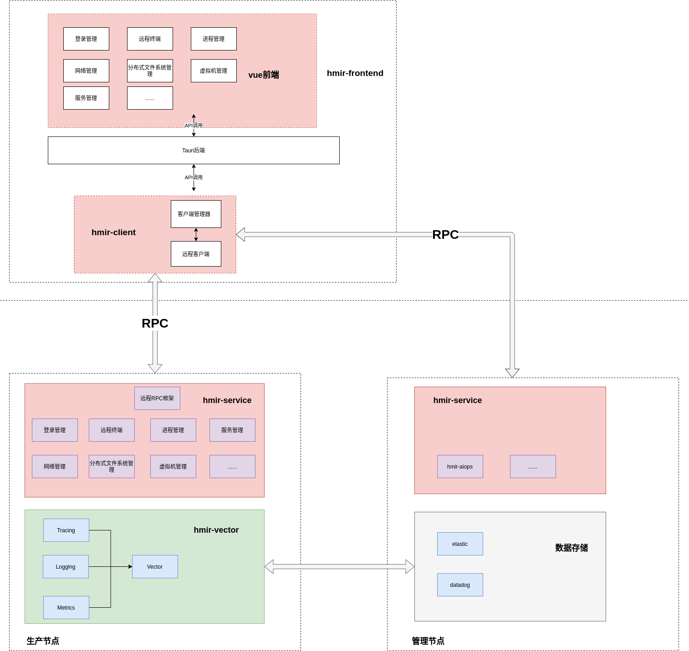
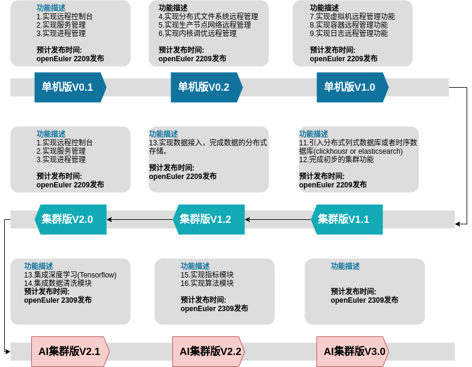

# 背景

# 快速安装

# 架构介绍

hmir是C/S架构，可以集成部署，也可以单机部署，整个架构由hmir-frontend和hmir组成，
在集群模式下hmir安装在生产节点内，hmir-frontend安装在管理节点内；单机模式下两者均
安装在生产节点内。

HMIR主要分为3层: hmir前端、hmir-ws客户端以及hmir服务端,其中:

- **HMIR前端**: 使用vue+ts+tauri框架实现客户端图形界面，由于tauri框架是跨平台的，因此C客户端图形
  可同时运行在Linux、MacOS以及Windows系统上。
- **HMIR客户端库**:封装了对RPC请求进行封装，同时实现了客户端管理以及基于token的认证管理,客户端作为Crate lib提供给hmir前端使用。
- **HMIR服务后端** : 实现了生产环境下的主机管理的RPC接口。

## HMIR服务后端

其中hmir软件主要分成三层,RPC框架层、远程接口层和FFI接口层；RPC框架层提供RPC调用注册接口
完成接口注册，RPC框架层以json-rpc的格式接收远程调用请求，将调用请求分发给远程接口层。

### RPC框架层

### 远程接口层

远程接口层包含了 ceph、 ipmi、net、svr、pkg、  ttyd、user等组件:

- ceph组件提供生产节点上分布式文件系统的远程管理、维护接口。
- ipmi组件提供生产节点上的IPMI远程管理、维护接口
- net组件提供生产节点的远程网络管理、维护接口
- svr组件提供生产节点的远程服务管理、维护接口
- pkg组件提供生产节点的远程包管理、维护接口
- ttyd组件提供生产节点的远程终端管理接口
- user组件提供生产节点的远程用户管理接口

远程接口层的可扩展性，

### FFI接口层

FFI接口层,由于Rust语言比较年轻，在实现功能的时候，难以避免的需要通过FFI来调用系统已有的C库，
为此HMIR提供FFI接口层来适配系统、应用的C库，以便和系统以及其他服务通信。
当前实现了以下FFI接口Crate

- hmir-ipmitool : 该FFI Crate对[ipmitool](https://github.com/ipmitool/ipmitool)进行了封装，用于实现ipmi管理。
- hmir-ovs      : 该FFI Crate对[openvswitch](https://www.openvswitch.org/)继续进行了封装,用于实现virtual switch的管理。
- hmir-virt     : 该FFI Crate对[libvirt](https://libvirt.org/)继续进行了封装，用于实现虚拟机管理。
- hmir-systemd  : 该FFI Crate对[systemd](https://systemd.io/)继续进行了封装，用于和systemd进行交互，完成服务管理。 
- hmir-ceph     : 该FFI Crate对[ceph](https://ceph.org/)进行了封装，用于和ceph分布式文件系统交互，完成ceph分布式文件系统管理。

## HMIR前端

- **vue前端**：主要使用vue+ts+tauri框架实现C端图形界面的开发，由于tauri框架是跨平台的，因此C端
  可同时运行在Linux、MacOS以及Windows系统上。
- **tauri后端**:通过tauri command的方式对hmir客户端提供的API进行封装，提供给vue前端调用。

### vue前端

### tauri后端

## HMIR客户端库

# HMIR项目路线图

HMIR主要通过3个大的阶段的场景，以敏捷开发模型，阶段性的落地相关解决方案:

- 第一阶段:单机版本,该版本HMIR软件具有单机管理和维护的能力，预计通过3次迭代完成版本发布。
- 第二阶段:集群版本，该版本HMIR软件具有集群管理和维护的能力，预计通过3次迭代完成版本发布。
- 第三阶段:AI集群版本能力，该版本HMI软件具有智能化集群管理和维护的能力，预计通过3次迭代完成版本发布。

# 参与贡献